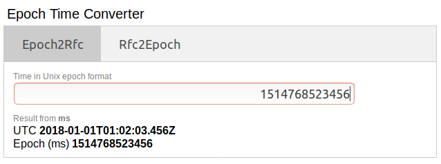

# epoch-time-converter

Plugin for Mozilla Firefox. Easily convert time stamps form epoch to ISO 8601 format. Supports input in seconds, milliseconds and nanoseconds.



## Test Data

```txt
Test Case               Input
----------------------  ----------------------
Input in seconds        1514769825
Input in milliseconds   1514769825789
Input in nanoseconds    1514769825789000000
```

## Deploy on Mozilla

Create ZIP archive from local repository.

```
npm run zip
```

Upload archive to https://addons.mozilla.org/.
